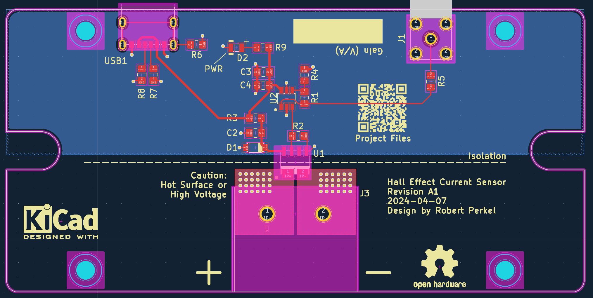

# Hall Effect Current Sensor

  

## Disclaimer

**Build and use this circuit at your own risk.** This circuit has not been tested to determine the maximum current possible (without the PCB igniting/melting) or the maximum input voltage on the current sensing side.

If high voltages are applied to the current sense side, the PCB may become a shock hazard. While the current sense side is isolated from the outputs - arcing, debris/dirt, assembly errors or design defects could cause it to jump to the output side. **Excerise extreme caution when working with hazardous voltages.**

## Tools and Components

- [KiCad 8.0.1](https://www.kicad.org/)  
- [FreeCad](https://www.freecad.org/)  

## Measuring the Current

The objective of this circuit is to measure current in an isolated fashion. For me (the author), this is to characterize current flow in a Stepper Motor, however this design can be used in other applications. To perform this task, a [Hall Effect sensor (ACS37030) by Allegro Microsystems](https://www.allegromicro.com/en/products/sense/current-sensor-ics/zero-to-fifty-amp-integrated-conductor-sensor-ics/acs37030-2) is used. 

**Note**: The ACS37030 has multiple different current ranges available, but at the time of this readme, only the 40A part is available. 

**Caution: While the sensor can measure high currents (20A/40A/65A), the PCB is NOT tested or characterized for this.** Use of high copper weight PCB material is likely required.  

This part was choosen due to it's high BW range (DC to 5 MHz), which is uncommon for these ICs. Since the current-side circuit is isolated, it is possible to measure current with high common voltages on the current sense side.

## Driving the Cable

To drive the cable to the oscilloscope, an [MCP633 Operational Amplifier by Microchip](https://www.microchip.com/en-us/product/MCP633) is implemented as a non-inverting amplifier with a gain of 3. The MCP633 has a Gain Bandwidth Product (GBWP) of 24 MHz, which provides enough BW to run at a gain of 3 without limiting the circuit performance. In this configuration, the output of this circuit is 99 mV/A. 

**Note**: The gain of the circuit can be changed by modifying the ratio of R1/R4 in the schematic. 

Power for this board is supplied over USB-C (at 5V). The ACS37030 is designed for 3V operation, so a simple Zener shunt regulator is used to regulate the power supply for the sensor, while the operational amplifier uses the raw USB bus voltage. 
